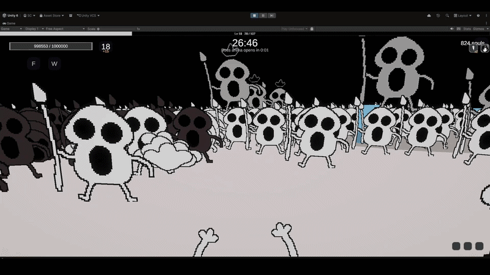
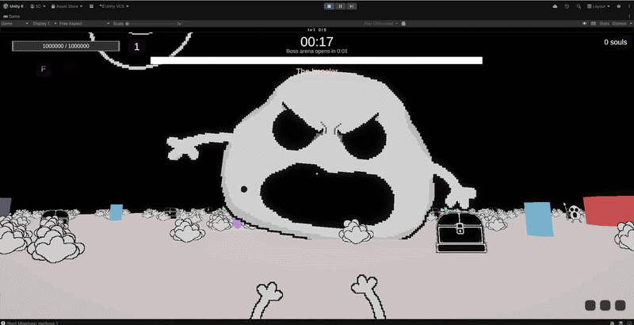

<h1 align="center">Hey, I'm Serif Cetinalp 👋</h1>

Full-stack developer & systems tinkerer based in Toronto, ON

  
  

---

### 🧑‍💻 About Me

I'm a CS grad (York University, Lassonde School of Engineering) who ended up loving the intersection of software architecture and game systems design. My favorite part of building anything is the moment a mechanic that only existed in my head turns into working code, that's basically my main hobby at this point. Give me a weird gameplay idea and I will not rest until it's simulated, balanced, and running in an engine.

I care a lot about *why* a system is built a certain way, not just that it works. That means SOLID principles, event-driven architecture over tangled dependencies, and separating data from behavior wherever I can. I split my time between full-stack web projects and Unity/C# systems work, and I'm always looking for the overlap between the two.

---

### 🔥 Currently Building: Bonkerzzz (Placeholder title, demo to be released soon)

A first-person, Unity 6 survivors-like inspired by *Megabonk* — built from scratch as a deep dive into real-time systems architecture rather than just "making a game."

**Why I'm building it:** I wanted a project that would force me to design real architecture under pressure — combat that has to feel instant, progression systems that have to stay balanced as they grow, and dozens of interacting subsystems (enemies, weapons, items, talismans) that all need to evolve independently without turning into spaghetti. Survivors-likes are deceptively perfect for this: simple on the surface, brutal on the backend if you don't structure it right.

**Scope & architecture highlights:**
- Strict separation between data definitions (ScriptableObjects) and runtime instances — new content gets configured, not coded
- A single centralized damage/combat resolver so every interaction in the game runs through one validated, testable path
- An event-driven messaging layer (`GameEvents`) that lets items, talismans, and UI react to gameplay without ever referencing the systems that caused it
- A shared-pool, tree-based progression system per weapon, replacing simple flat upgrades
- Currently extending the project with a planned backend leaderboard — PostgreSQL-backed persistence for user profiles and scores, pushing the project into full-stack territory

  
  

---

### 🛠️ Skills

**Languages**

**Frameworks & Libraries**

**Tools**

---

### ⚡ Quick Facts

- I default to building the architecture first, then the feature — data vs. runtime, event buses, single-source-of-truth resolvers, you name it
- I use AI as a mentor, not a crutch — I get a task breakdown, then write and review the code myself so I actually understand every line
- Off the keyboard, I train calisthenics and recently achieved my first clean muscle-up
- My favorite kind of project is one where a "fun mechanic" idea has to survive contact with real system design

---

### 🚀 Highlighted Projects

| Project | Description | Tech |
|---|---|---|
| **[VentSpace](https://serif-ventspace.vercel.app/)** | Full-stack anonymous posting platform with comments, reactions, tag-based search, and an AI-powered support chatbot. Built and deployed end-to-end, including JWT auth and a relational data layer. | React, TypeScript, Node.js, Express, Prisma, PostgreSQL, JWT, OpenAI API |
| **[Tea Cafe Simulator](https://github.com/Serif-C/3D-Cozy-Tea-Cafe-Sim)** | A systems-and-tooling-focused simulation project — modular SOLID architecture, custom editor tooling, grid placement/collision validation, and object pooling that doubled concurrent agent capacity. | Unity, C#, FSM, ScriptableObjects, Object Pooling |
| **Bonkerzzz** *(in development, see above)* | First-person real-time simulation and combat framework with data-driven design, a centralized combat resolver, and event-driven subsystems. Backend leaderboard in progress. | Unity, C#, ScriptableObjects, Event-Driven Architecture |
| **[Developer Portfolio](https://serif-c.github.io/My-Portfolio/)** | Personal portfolio site with a custom-animated hero banner (CSS particle effects, keyframe transitions) and a responsive, filterable project UI. | React, TypeScript, TailwindCSS, Vite |

---

<em>Always down to talk systems design, Unity architecture, or full-stack builds — feel free to reach out.</em>

